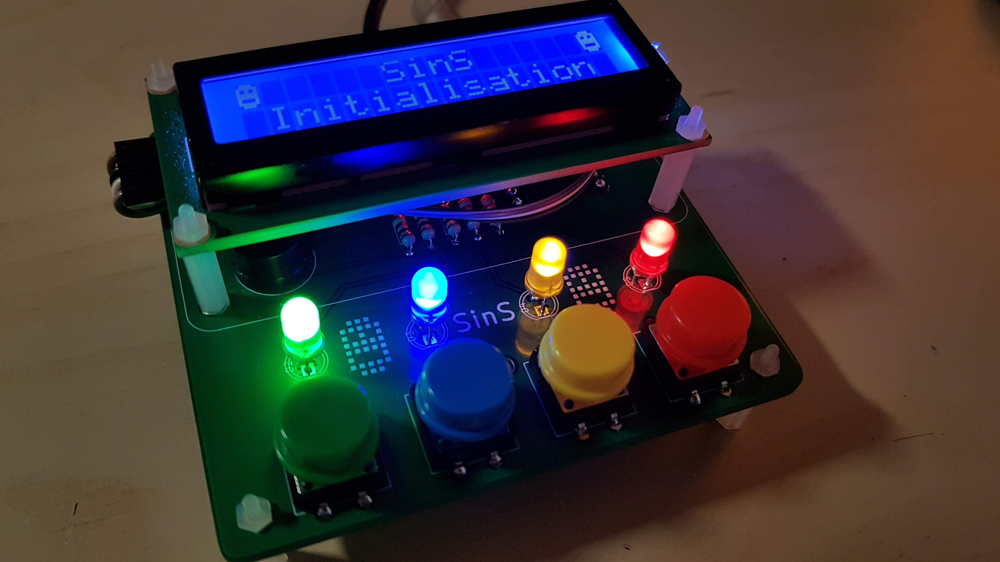
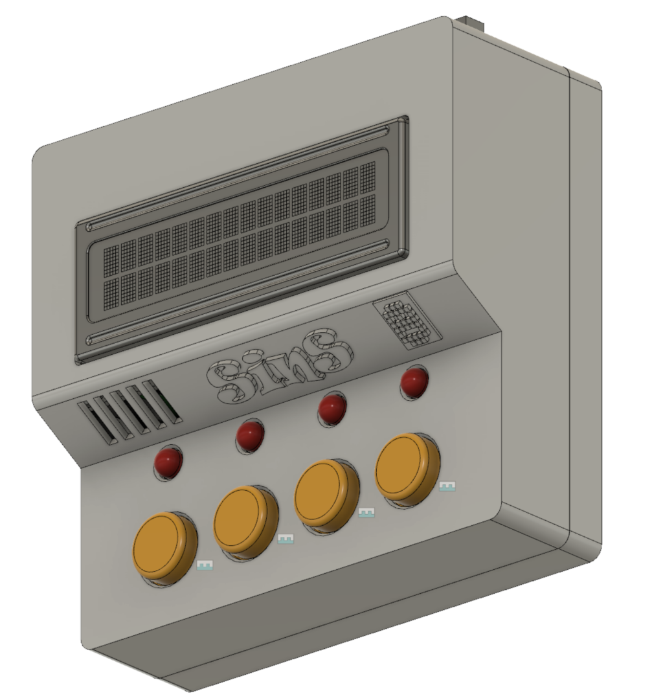

# SinS
Dans le cadre du concours du #ChallengeDesMakers2020, notre équipe #OuiAreSins composée de François de https://www.framboise314.fr/, Frédéric de https://garatronic.fr/index.php/fr/, Dominique de https://shop.mchobby.be/fr/ et moi même Olivier de https://www.papsdroid.fr/ nous réalisons un jeux de mémoire visuelle et auditive à base d'une PYBStick26, mais ne vous y trompez pas:  Sins Is Not Simon !

Il faut retrouver les clés de 10 coffres à trésors cachés dans un immense labyrinthe.

Dans chaque pièce où vous entrez, il y a 4 sorties de 4 couleurs distinctes. Vous avez un guide qui ouvre le chemin et vous montre les  3 prochaines portes à ouvrir pour trouver une première clé. Si vous réussissez, votre guide vous montre alors les 3 portes suivantes à ouvrir y compris les 3 premières déjà empruntées, et ainsi de suite... Le jeux se termine quand vous avez rapporté les 10 clés, ou bien quand vous vous trompez et êtes perdu dans le labyrinthe.

Vous pouvez jouer à plusieurs pour trouver les 10 clés: organisez votre équipe pour retenir le bon ordre d'ouverture des portes.

## matériel nécessaire
* 1 PYBStick26 avec ses deux barettes femelles 13pins soudées.
* 4 leds 5mm (Verte, Bleue, Jaune, Rouge)
* 4 résistances 220 ohms (pour les leds)
* 1 résistance 330 ohms (pour le buzzer), sinon 220 ohms sera aussi valable.
* 1 diode de redressement 1N4148 (optionel, le prototype fonctionne sans: c'est une diode de roue libre pour protéger le buzzer)
* 1 petit buzzer passif (attention à bien prendre un passif)
* 4 boutons poussoirs (6mm pour une breadboard, ou 12mm avec capuchons colorés ronds vert, bleu, jaune et rouge pour le circuit imprimé)
* 1 écran LCD 1602 avec backpack I2C
* 1 nappe souple femelle/femelle 4 pins, pour connecter le LCD au circuit.
* 1 connecteur pin header coudé 4 pins mâles 2.54mm, pour relier le LCD (impéartivement coudé pour le circuit imprimé)

Si vous comptez souder les composants sur le circuit imprimé proposé:
* 1 circuit imprimé, à faire fabriquer à partir des fichier GERBER_SINS.zip fournis.
* 1 alimentation 5V DC avec Jack femelle, 1A est suffisant 
* 1 diode Shotky SB560 (elle protège l'alimentation externe 5V quand l'USB est connectée)
* 1 connecteur Barrel JackDC mâle, 3 points de soudure
* 2 pin header mâle 13 pins 2.54mm à souder (pour y connecter la PYBStick)
* quelques entretoises M2.5 (ou M2 aussi ça passera): 8*M/F 15mm + 6 écrous + 2 vis

Le lien avec le tutoriel de montage sera bientôt ajouté sur ce dépôt.

## boîtier imprimé 3D 

François nous a réalisé un boîtier sur mesure à imprimer en 3D.
Le [lien avec les sources](https://ouiaremakers.com/posts/tutoriel-diy-un-boitier-en-impression-3d-pour-le-projet-ouiaresins)

## prototypage sur breadboard

## scripts micropython à installer sur la PYBStick
Dans le répertoire PYBFLASH qui s'affiche à l'ordinateur lors du branchement de la PYBStick26 sur un port USB, déposez tous les fichiers Micropython ci-dessous:
* buttons.py : gestion du rack de boutons poussoirs
* buzzer.py  : gestion du buzzer
* lcd.py     : gestion du LCD
* lcd2ic.py  : conçu par [MC Hobby](https://github.com/mchobby/pyboard-driver/tree/master/PYBStick): gestion du LCD via I2C de la PYBStick
* leds.py    : gestion du rack de leds
* main.py    : script principaldu jeux
* pwm.py     : conçu par [MC Hobby](https://github.com/mchobby/pyboard-driver/tree/master/PYBStick) : gestion des sorties PWM de la PYBStick

## synoptique du jeux
Un message d'accueil avec musique apparait, ainsi qu'une petite animation colorée des leds.

Le joueur est ensuite invité à choisir un mode de jeux:
* __Vert__ : facile. De nouvelles séquences de 3 portes à ouvrir sont rajoutées sans modifier les précédentes. Chaque porte est associée à un son.
* __Bleu__ : moyen, idem que le mode vert mais sans les sons
* __Jaune__: difficile. Dans ce mode, la séquence de portes à ouvrir est réinitialisée au hasard depuis le début, avec les sons activés.
* __Rouge__: expert. Idem mode Jaune mais sans les sons.

Le mode choisi est confirmé sur l'écran LCD

Le joueur est alors invité à :
* observer la séquence de 3 portes (avec ou sans son, selon le mode choisi) à ouvrir, indiquée par le guide
* reproduire la même séquence à l'aide du rack de boutons poussoir

S'il gagne: la led verte va clignoter 3 fois, une clé est trouvée, et si le record du mode est battu il est aussi mis à jour.

S'il se trompe, vous êtes perdu dans le labyrinthe de la PybStick! Une musique de la loose est jouée, la led rouge clignote 3 fois, et un message est indiqué sur l'écran.  Le jeux retourne alors sur l'écran de choix du mode.

Si vous avez trouvé les 10 clés: bravo et respect !

